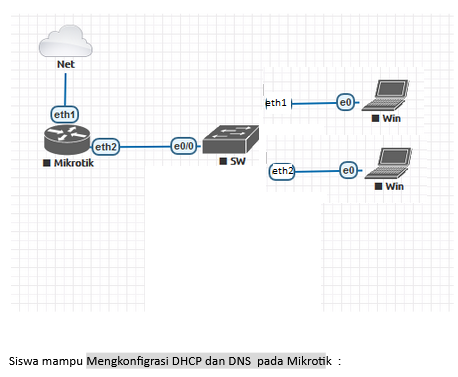
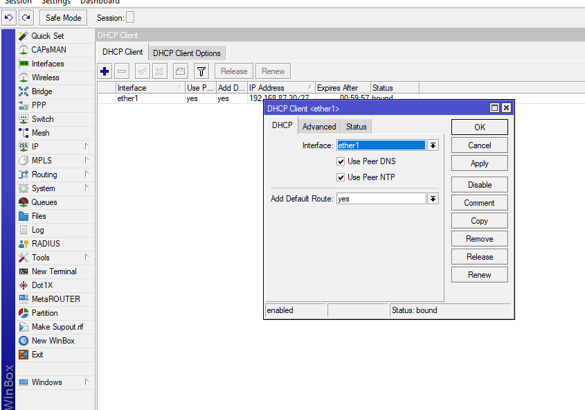
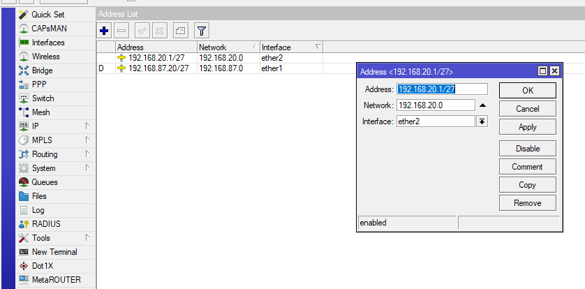
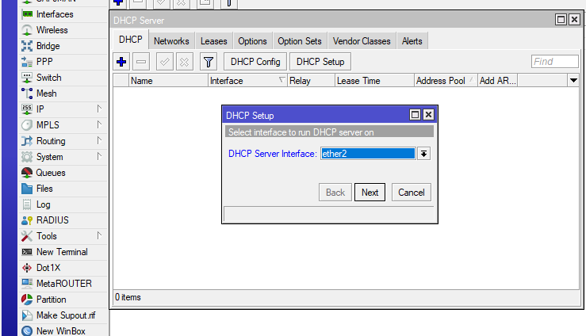
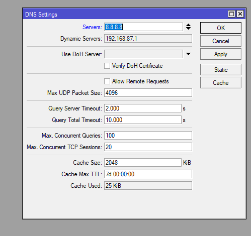
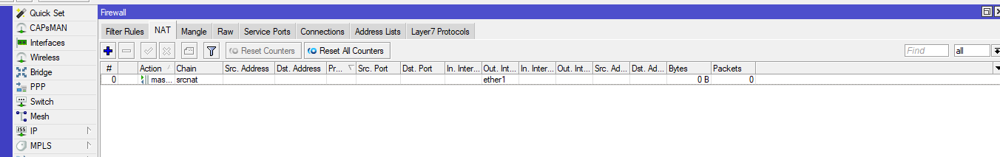
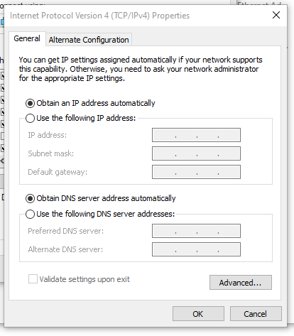
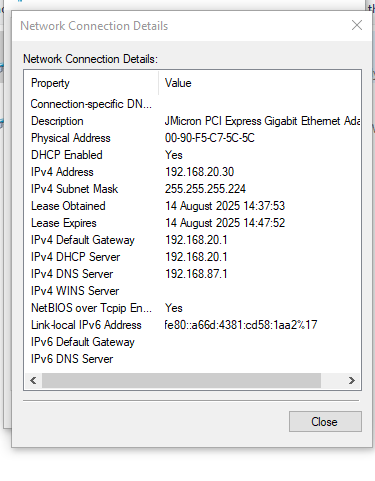
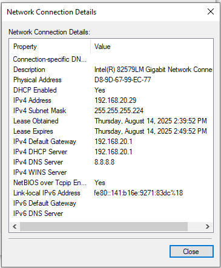

# LAB-16-DHCP-Server-dan-Static-Leases
tanggal 14 agustus 2025

# konfigurasi DHCP dan static leases

Static Lease merupakan sebuah cara yang dapat digunakan pada DHCP Server untuk memberikan sebuah Fixed IP kepada Client.

**Langkah-langkahnya:**

1. masuk ke mikrotik via winbox pilih  
   menu: IP > DHCP CLIENT  
   klik tanda +  
   Setting DHCP Client agar Mikrotik terhubung ke intrnet melalui ether1 yang terhubung ke ISP.  

2. buat ip static buat ether2 di  
   menu: IP > Address  
   klik +  
   seting address untuk interface ether2  

3. membagikan IP ke client secara otomatis.  
   menu: IP > DHCP server > DHCP setup  
   lalu klik next hingga selesai  
   

4. Setting DNS, masukan DNS google.  
   menu: IP > DNS  

5. Setting IP Firewall NAT agar client bisa mengakses ke internet.  
   menu: IP > Firewall > NAT  
   pilih menu sesui gambar di bawah   

6. Pindah ke PC Client untuk setting  obtain auto di IPv4.    

7. pengujian dengan cara cek detail di laptop client.
         
Laptop 1  

Laptop 2  

8. Jika PC Client sudah mendapat IP, buka kembali Winboxnya
   Buka IP > DHCP SERVER > Lease
9. pilih MAC Client yang akan di static kan.
10. Klik Make static agar perangkat itu punya IP yang tetap tanpa perlu setting IP manual.
Sekarang client yang sudah di config menjadi static lease akan mendapatkan IP yang sama terus walau mengunakan auto obtain.
# kesimpulan 
Dengan menerapkan Static Lease, teman-teman bisa mendapatkan IP 'pseudo-Static' meski menggunakan DHCP Server.
